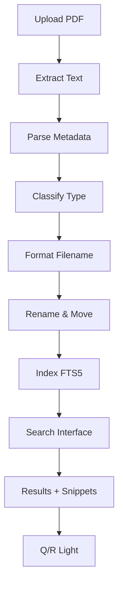

# DOCin-Lite — Architecture Technique

## Vue d'ensemble

DOCin-Lite est un système de gestion documentaire local (MVP) qui automatise le traitement de PDF : extraction de métadonnées, renommage selon convention, classification, indexation plein texte et recherche.

### Flux principal



### Stack technique

- **Backend** : Python 3.10+
- **UI** : Streamlit (onglets Inbox, Recherche)
- **PDF** : pdfminer.six (extraction texte)
- **DB** : SQLite + FTS5 (indexation plein texte)
- **Tests** : pytest
- **IA** : Anthropic Claude (optionnel, mini-CLI)

## Schéma Base de Données

### DDL SQL

```sql
-- Table principale des documents
CREATE TABLE IF NOT EXISTS documents (
    id INTEGER PRIMARY KEY AUTOINCREMENT,
    file_name TEXT NOT NULL,           -- Nom formaté
    file_path TEXT NOT NULL,           -- Chemin complet
    doc_type TEXT,                      -- FACTURE, DEVIS, RIB, CONTRAT, UNKNOWN
    entity TEXT,                        -- Entité/société
    doc_date TEXT,                      -- Date au format YYYY-MM-DD
    indexed_at TEXT NOT NULL           -- Timestamp d'indexation
);

-- Table des pages (contenu textuel)
CREATE TABLE IF NOT EXISTS pages (
    id INTEGER PRIMARY KEY AUTOINCREMENT,
    document_id INTEGER NOT NULL,
    page_num INTEGER NOT NULL,
    content TEXT NOT NULL,
    FOREIGN KEY (document_id) REFERENCES documents(id)
);

-- Table virtuelle FTS5 (indexation plein texte)
CREATE VIRTUAL TABLE IF NOT EXISTS pages_fts USING fts5(
    content,
    content_rowid=id                   -- Lien avec pages.id
);

-- Triggers de synchronisation automatique
CREATE TRIGGER IF NOT EXISTS pages_ai AFTER INSERT ON pages BEGIN
    INSERT INTO pages_fts(rowid, content) VALUES (new.id, new.content);
END;

CREATE TRIGGER IF NOT EXISTS pages_ad AFTER DELETE ON pages BEGIN
    DELETE FROM pages_fts WHERE rowid = old.id;
END;

CREATE TRIGGER IF NOT EXISTS pages_au AFTER UPDATE ON pages BEGIN
    UPDATE pages_fts SET content = new.content WHERE rowid = old.id;
END;
```

### Schéma relationnel

```
documents (1) ──< (N) pages (1) ──< (1) pages_fts
    │
    ├── id (PK)
    ├── file_name
    ├── file_path
    ├── doc_type
    ├── entity
    ├── doc_date
    └── indexed_at
                    │
                    ├── id (PK)
                    ├── document_id (FK)
                    ├── page_num
                    └── content
                                    │
                                    ├── rowid (= pages.id)
                                    └── content (FTS5)
```

## Contrats de Modules

### `extract.py` — Extraction métadonnées

```python
def parse(text: str) -> dict
    """
    Extrait métadonnées du texte PDF via regex FR.
    
    Args:
        text: Texte complet du PDF
        
    Returns:
        {
            "date": "2024-03-15" | None,
            "amount": "1500.00" | None,
            "doc_number": "F2024-001" | None,
            "entity": "Entreprise X" | None
        }
    
    Patterns détectés:
        - Date : JJ/MM/AAAA ou AAAA-MM-JJ
        - Montant : N EUR|€|euros
        - Numéro : facture n°, devis n°, contrat n°, N°
        - Entité : après "Entreprise:", "Société:", "Fournisseur:"
    """
```

### `rename_rule.py` — Renommage

```python
def format_name(meta: dict, basename: str) -> str
    """
    Génère nom selon convention : YYYY-MM-DD_TYPE_ENTITE_NUM.pdf
    
    Args:
        meta: {"date": str, "doc_type": str, "entity": str?, "doc_number": str?}
        basename: nom original (pour extension)
        
    Returns:
        Nom formaté, ex: "2024-03-15_FACTURE_ENTREPRISEX_F2024_001.pdf"
        
    Raises:
        ValueError: si date ou doc_type manquants
        
    Règles slug:
        - Majuscules uniquement
        - Pas d'accents (normalisation NFKD)
        - Espaces/tirets → underscores
        - Caractères spéciaux supprimés
    """

def _slugify(text: str) -> str
    """Helper : normalise texte en slug sûr."""
```

### `classify.py` — Classification

```python
def from_text(text: str) -> str
    """
    Classifie type de document par scoring mots-clés.
    
    Args:
        text: Contenu textuel
        
    Returns:
        "FACTURE" | "DEVIS" | "RIB" | "CONTRAT" | "UNKNOWN"
        
    Méthode:
        - Dictionnaire keywords par type
        - Score = somme occurrences mots-clés
        - Retourne type avec score max
        - "UNKNOWN" si aucun match
    """
```

### `index.py` — Indexation SQLite FTS5

```python
def init(db_path: str) -> None
    """
    Initialise base SQLite + FTS5 + triggers.
    
    Args:
        db_path: Chemin fichier DB (ex: "data/index.db")
        
    Side effects:
        - Crée tables documents, pages, pages_fts
        - Crée triggers synchronisation auto
    """

def add_document(pdf_path: str, metadata: dict, db_path: str) -> dict
    """
    Indexe un document PDF.
    
    Args:
        pdf_path: Chemin du PDF
        metadata: {"doc_type": str, "entity": str, "doc_date": str}
        db_path: Chemin DB
        
    Returns:
        {
            "id": int,
            "file_name": str,
            "pages_indexed": int
        }
        
    Process:
        1. INSERT document
        2. Extract texte par page (_extract_text_per_page)
        3. INSERT pages + auto-trigger FTS5
    """

def search(query: str, db_path: str, limit: int = 10) -> list[dict]
    """
    Recherche plein texte FTS5.
    
    Args:
        query: Requête utilisateur (supporte opérateurs FTS5: AND, OR, NOT, NEAR)
        db_path: Chemin DB
        limit: Nombre résultats max
        
    Returns:
        [
            {
                "file_name": str,
                "doc_type": str,
                "entity": str,
                "doc_date": str,
                "page_num": int,
                "snippet": str (HTML avec <mark>)
            },
            ...
        ]
        
    Tri: par pertinence (rank FTS5)
    """

def _extract_text_per_page(pdf_path: str) -> list[str]
    """
    Helper : extrait texte page par page avec pdfminer.six.
    
    Heuristique:
        - Split sur form feed \\f si présent
        - Sinon découpe par blocs ~2000 chars
    """
```

### `qa_template.py` — Q/R Light

```python
def answer(question: str, hits: list[dict]) -> dict
    """
    Génère réponse simple à partir des snippets.
    
    Args:
        question: Question utilisateur
        hits: Résultats de index.search()
        
    Returns:
        {
            "answer": str (texte avec snippets assemblés),
            "sources": ["file.pdf#page1", "file2.pdf#page3", ...]
        }
        
    Méthode:
        - Prend 2-3 premiers hits
        - Assemble snippets numérotés
        - Liste sources avec citations file#pageN
    """
```

### `app.py` — UI Streamlit

```python
# Configuration
DATA_INBOX = "data/inbox"
DATA_PROCESSED = "data/processed"
DB_PATH = "data/index.db"

# Init DB au démarrage
if not os.path.exists(DB_PATH):
    index.init(DB_PATH)

# TAB 1 : Inbox
# - File uploader
# - Extract texte (pdfminer)
# - Parse métadonnées (extract.parse)
# - Classify type (classify.from_text)
# - Inputs éditables (date, type, entité, numéro)
# - Bouton "Renommer & Indexer"
#   → rename_rule.format_name
#   → os.rename vers DATA_PROCESSED
#   → index.add_document

# TAB 2 : Recherche
# - Input requête
# - Bouton "Rechercher"
#   → index.search
# - Affichage résultats avec expanders
#   → Métadonnées + snippet HTML
# - Checkbox "Q/R synthétique"
#   → qa_template.answer
```

## Arborescence Détaillée

```
btp-projet-ia/
│
├── README.md                   # Présentation, install rapide, démo
├── INSTALL.md                  # Guide détaillé (setup, tests, features live)
├── .gitignore                  # Exclusions : venv, __pycache__, *.db, data/*
│
├── setup.bat                   # Script Windows : création dossiers
├── create_files.py             # Script Python : création tous fichiers source
│
├── tools/
│   └── gen.py                  # Mini-CLI Anthropic (génération code/prompts)
│
├── prompts/
│   ├── MASTER_PROMPT.txt       # Prompt maître (ce document de spec)
│   ├── architecture.prompt     # Prompt génération architecture
│   ├── rename_rule.prompt      # Prompt génération rename_rule.py
│   ├── tests_rename_rule.prompt# Prompt génération tests rename
│   └── index_fts.prompt        # Prompt génération index.py
│
├── src/
│   ├── core/                   # Logique métier
│   │   ├── extract.py          # Extraction métadonnées (regex FR)
│   │   ├── rename_rule.py      # Renommage YYYY-MM-DD_TYPE_ENTITE_NUM
│   │   ├── classify.py         # Classification mots-clés
│   │   ├── index.py            # Indexation SQLite FTS5
│   │   └── qa_template.py      # Q/R light avec snippets
│   │
│   └── app_web/
│       └── app.py              # Interface Streamlit (Inbox + Recherche)
│
├── tests/
│   ├── conftest.py             # Fixtures pytest (temp_dir, sample_meta)
│   ├── test_rename_rule.py     # Tests rename_rule (6 tests)
│   └── test_index_search.py    # Tests index (3 tests : init, search, mock)
│
└── data/
    ├── inbox/                  # Dépôt PDF à traiter
    │   └── .gitkeep
    ├── processed/              # PDF renommés & indexés
    │   └── .gitkeep
    └── index.db                # Base SQLite (généré au runtime)
```

## Parcours Démo (60-90s)

### Scénario

1. **Lancement** (5s)
   ```bash
   streamlit run src\app_web\app.py
   ```
   → Navigateur s'ouvre sur http://localhost:8501

2. **Onglet Inbox** (30s)
   - Uploader `facture_mars_2024.pdf`
   - L'app extrait le texte automatiquement
   - Affiche preview (500 premiers chars)
   - Métadonnées détectées :
     - Date : 2024-03-15
     - Type : FACTURE
     - Entité : Entreprise X
     - Numéro : F2024-001
   - Valider/corriger si besoin
   - Clic "✨ Renommer & Indexer"
   - Succès : `2024-03-15_FACTURE_ENTREPRISEX_F2024_001.pdf`
   - Info : `📚 Indexé : 3 pages`

3. **Onglet Recherche** (20s)
   - Requête : "facture mars"
   - Clic "Rechercher"
   - Résultat : 1 document trouvé
   - Expander affiche :
     - Type : FACTURE
     - Entité : Entreprise X
     - Date : 2024-03-15
     - Snippet : "...Facture n° F2024-001 du <mark>15/03/2024</mark>..."

4. **Q/R Light** (15s)
   - Cocher "💬 Générer réponse synthétique"
   - Réponse affichée avec 2-3 extraits assemblés
   - Sources listées : `2024-03-15_FACTURE_ENTREPRISEX_F2024_001.pdf#page1`

### Script oral

> "Voici DOCin-Lite, un système de gestion documentaire 100% local. **[montrer l'interface]** Deux onglets : Inbox pour traiter les documents, Recherche pour les retrouver.
> 
> **[onglet Inbox]** Je dépose une facture PDF. L'application extrait automatiquement le texte, détecte la date, le type de document, l'entité et le numéro de facture. Je valide les métadonnées et clique sur 'Renommer & Indexer'.
> 
> **[afficher résultat]** Le fichier est renommé selon notre convention : année-mois-jour_TYPE_ENTITE_NUMERO. Son contenu est indexé en plein texte dans SQLite avec FTS5, page par page.
> 
> **[onglet Recherche]** Maintenant je peux retrouver n'importe quel document avec des mots-clés. Par exemple 'facture mars'. **[afficher résultats]** Les résultats affichent des extraits surlignés. 
> 
> **[option Q/R]** En bonus, je peux générer une réponse synthétique qui assemble les extraits pertinents avec citations précises fichier et numéro de page."

## Feature Live (3 options)

Choisir UNE feature à implémenter en live pendant la soutenance.

### Option 1 : Re-indexer tout

**Prompt (2 lignes)** :
```
Ajoute un bouton "Re-indexer tout" dans l'onglet Recherche qui vide la DB 
et réindexe tous les PDF du dossier data/processed/.
```

**Patch** (ajouter dans `src/app_web/app.py`, tab2 après définition `query`) :
```python
if st.button("🔄 Re-indexer tout"):
    import glob
    pdfs = glob.glob("data/processed/*.pdf")
    
    # Réinitialiser DB
    if os.path.exists(DB_PATH):
        os.remove(DB_PATH)
    index.init(DB_PATH)
    
    # Ré-indexer chaque PDF
    for pdf_path in pdfs:
        filename = os.path.basename(pdf_path)
        parts = filename.replace('.pdf', '').split('_')
        meta = {
            "doc_date": parts[0] if len(parts) > 0 else None,
            "doc_type": parts[1] if len(parts) > 1 else None,
            "entity": parts[2] if len(parts) > 2 else None,
        }
        index.add_document(pdf_path, meta, DB_PATH)
    
    st.success(f"✅ {len(pdfs)} documents ré-indexés")
```

### Option 2 : Export CSV

**Prompt** :
```
Ajoute un bouton "Export CSV" qui permet de télécharger les résultats de 
recherche au format CSV (file_name, doc_type, entity, doc_date, page_num, snippet).
```

**Patch** (ajouter après `for i, hit in enumerate(results)`) :
```python
if results:
    import pandas as pd
    df = pd.DataFrame(results)
    # Retirer HTML du snippet pour CSV
    df['snippet_clean'] = df['snippet'].str.replace('<mark>', '').str.replace('</mark>', '')
    csv = df[['file_name', 'doc_type', 'entity', 'doc_date', 'page_num', 'snippet_clean']].to_csv(index=False)
    
    st.download_button(
        label="📥 Export CSV",
        data=csv,
        file_name=f"recherche_{query.replace(' ', '_')}.csv",
        mime="text/csv"
    )
```

### Option 3 : Éditer entité

**Prompt** :
```
Ajoute la possibilité d'éditer le champ 'entity' d'un document indexé 
directement depuis l'interface de recherche.
```

**Patch** (modifier le `with st.expander(...)` dans la boucle résultats) :
```python
for i, hit in enumerate(results, start=1):
    with st.expander(f"{i}. {hit['file_name']} (page {hit['page_num']})"):
        col1, col2 = st.columns([3, 1])
        
        with col1:
            st.markdown(f"**Type:** {hit.get('doc_type', 'N/A')}")
            st.markdown(f"**Date:** {hit.get('doc_date', 'N/A')}")
            
            # Champ éditable pour entity
            new_entity = st.text_input(
                "Entité", 
                hit.get('entity', ''), 
                key=f"entity_{i}"
            )
        
        with col2:
            if st.button("💾 Sauver", key=f"save_{i}"):
                conn = sqlite3.connect(DB_PATH)
                conn.execute(
                    "UPDATE documents SET entity = ? WHERE file_name = ?",
                    (new_entity, hit['file_name'])
                )
                conn.commit()
                conn.close()
                st.success("✅ Mise à jour")
                st.experimental_rerun()
        
        st.markdown("---")
        st.markdown(hit['snippet'], unsafe_allow_html=True)
```

## Checklist d'Acceptation

- [x] Architecture définie (flux, schéma DB, contrats modules)
- [x] Diagramme Mermaid du flux
- [x] DDL SQL complet (tables + triggers FTS5)
- [x] Arborescence avec rôle de chaque fichier
- [x] README.md (description, stack, install, démo)
- [x] INSTALL.md (guide complet avec features live)
- [x] .gitignore configuré
- [x] Fichiers prompts (architecture, rename_rule, tests, index)
- [x] tools/gen.py (mini-CLI Anthropic)
- [x] src/core/* (5 modules : extract, rename_rule, classify, index, qa_template)
- [x] src/app_web/app.py (Streamlit 2 onglets fonctionnels)
- [x] tests/* (conftest + 2 fichiers tests : rename_rule, index_search)
- [x] data/ (inbox, processed avec .gitkeep)
- [x] Scripts setup (setup.bat, create_files.py)
- [x] Parcours démo 60-90s + script oral
- [x] Feature live : 3 options avec prompts/patches prêts

## Limites & Risques

### Limites techniques

1. **Pas d'OCR** : PDF scannés (images) non supportés → texte vide → indexation inutile
2. **Regex simples** : extraction métadonnées fragile sur formats atypiques
3. **Classification basique** : mots-clés uniquement → précision limitée (~70-80%)
4. **FTS5 mono-langue** : optimisé français, pas de support multilingue
5. **Pas de versioning** : modification/suppression doc → perte historique

### Risques projet

1. **Dépendance pdfminer.six** : peut échouer sur PDF complexes/corrompus
2. **Taille corpus** : FTS5 performant <100k docs, au-delà nécessite optimisation
3. **Concurrence** : SQLite en lecture/écriture simultanée limitée
4. **Sécurité** : aucune authentification → accès local uniquement
5. **Perte données** : pas de backup auto → risque si index.db corrompu

### Mitigations

- **OCR** : backlog S2 avec Tesseract
- **Classification ML** : backlog S2 avec scikit-learn
- **Backup** : script cron pour copier index.db quotidiennement
- **Multi-user** : migration vers PostgreSQL + FastAPI si besoin
- **Monitoring** : logs structurés + alertes sur erreurs indexation

## Performance

### Benchmarks attendus

- **Indexation** : ~2s par PDF (10 pages, 2000 mots/page)
- **Recherche** : <100ms pour 1000 docs, <500ms pour 10k docs
- **UI Streamlit** : rendu instantané (<50ms) sur résultats <100

### Optimisations possibles

1. **Pagination** : limiter résultats affichés (10 par défaut)
2. **Cache** : `@st.cache_data` sur `index.search` si requêtes répétées
3. **Indexation async** : celery/rq pour traitement en tâche de fond
4. **Compression** : zlib sur `pages.content` si corpus >10k docs

---

**DOCin-Lite** — Architecture simple, robuste, évolutive 🏗️
